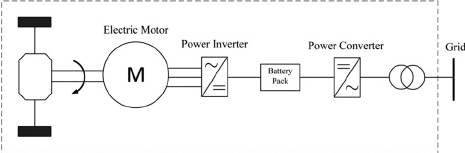

# DCM Lab Mini Project

The problem statement we chose to model the control system circuit of an EV,
specifically how when the controller specifies an RPM requirement the entire
system reacts.

Required inputs to our system:
- required RPM for a wheel from user

Required output of our system:
- Simulation of the model getting to the required state

Schematic Diagram:

---

## Inferences

- Battery:
  - Depends on use case, but between
    - 30kWh to 100kWh
    - 400V to 800V
- Motors:
  - Many types of motors can be used
    - BLDC Hub: for cases where no transmission is needed
    - BLDC In Runner: Used with a differential for 4 wheel drive
    - Brushed: Older cars use this
    - AC Induction: Three phase induction motors are best used for high power
    where self starting is needed.
- Controller:
  - DC-DC System: Infotainment system, headlights etc.
  - Three Phase Inverter: Converts DC from battery to three phase AC for motors
  - Speed Controller: Controls speed
  - Regeneration: Battery charges when breaking etc.

## Resources used

- [Engineer's Introduction to EVs, circuitdigest](https://circuitdigest.com/article/an-engineers-introduction-to-electric-vehicles)
- [Inverters and Converters in Hybrids and EV, Treehugger](https://www.treehugger.com/how-inverters-and-converters-work-85612)
- [Intro to Electric Vehicle Battery Systems, allaboutcircuits](https://www.allaboutcircuits.com/technical-articles/introduction-to-electric-vehicle-battery-systems/)
- [How Electric Vehicles Work, SEAI](https://www.seai.ie/technologies/electric-vehicles/what-is-an-electric-vehicle/how-electric-vehicles-work/#:~:text=use%20AC%20power.-,Inverter,frequency%20of%20the%20alternating%20current.)
- Schematic Diagram, [Effect of Plug-in Vehicles](https://www.researchgate.net/figure/Schematic-diagram-of-a-plug-in-electric-vehicle_fig2_283195430)
- [Three Phase Inverter, electronic-tutorial](https://www.electronics-tutorial.net/dc-to-ac-inverter/three-phase-inverter/)
- [DC to AC Inverter, electronic-tutorial](https://www.electronics-tutorial.net/dc-to-ac-inverter/)
- 